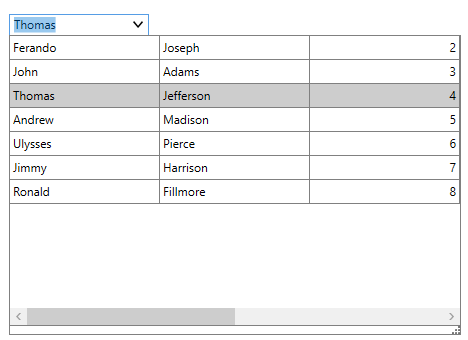

# How to hide the column header of the DropDown Grid in WPF MultiColumnDropDownControl (SfMultiColumnDropDownControl)?

## About the sample

This sample illustrates how to hide the column header of the DropDown Grid in WPF MultiColumnDropDownControl (SfMultiColumnDropDownControl).

[WPF MultiColumnDropDown](https://www.syncfusion.com/wpf-controls/multi-column-dropdown) (SfMultiColumnDropDownControl), allows you to hide the column header of the DataGrid displayed in the dropdown by setting the header row height of the dropdown grid to Zero.

```C#

this.multiColumnDropDown.Loaded += OnMultiColumnDropDown_Loaded;

private void OnMultiColumnDropDown_Loaded(object sender, RoutedEventArgs e)
{
    this.multiColumnDropDown.GetDropDownGrid().HeaderRowHeight = 0;
}

```



## Requirements to run the demo

Visual Studio 2015 and above versions